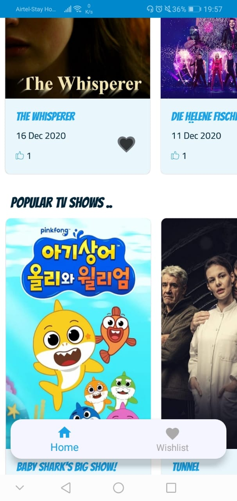
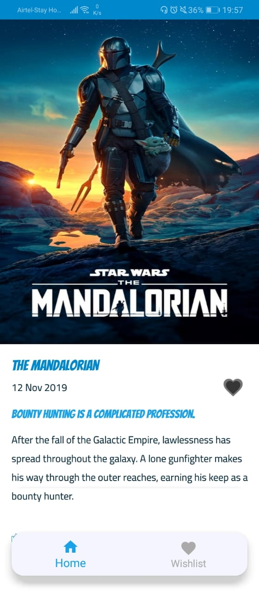
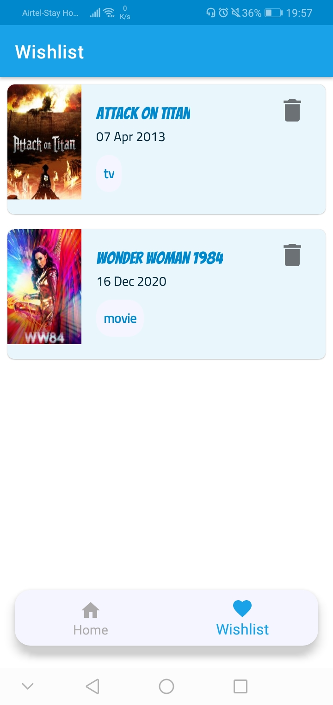

## Codemasters Submission

### Implementation Details
- uses **`AndroidX`**
- uses **`Kotlin`**
- uses **`databinding`**
- uses android jetpack **`navigation`** and **`architecture`** components
- architectural pattern **`MVVM`** as recommended by Google
- deals with security issues by keeping secrets like `api_key` isolated from source code
- uses **two** types of **caching** mechanism.
  - Glide Image Loader cache implementation. My implementation caches remote images upto 50mb which allows app to render high res images faster.
  - API caching. Caches network calls made by **`retrofit`** and loads data accordingly. These allows the user to have offline mode even when no internet is available.
- uses separate build flavors for `grameenphone` and `telenor`. (Different icons and different app name)
- uses `junit`, `espresso` and `roboelectric` for testing

### Features

#### Home Page

1. The Home Screen fetches 3 lists of data from the given API and populates 3 recycler views with it. The first two recycler views scroll horizontally and the last one scrolls vertically as specified. 

2. A loader animation (`lotte`) is shown every time the app waits for an api call.

3. Theres a wishlist icon in this page, that shows if any of the movie/tv show in this page was wishlisted by the user.

#### Detail Page

1. This page renders a full screen detail of a movie/tv show.

2. Theres a `add to wishlist` feature in this page. Pressing the `heart` shaped button toggles a item between being wishlisted and not.

3. The wishlisted items are stored in a local `SQLite` database (powered by `ROOM` ORM)

#### Wishlist Page

1. This page shows the items currently in the user's wishlist.

2. A user can remove an item from the wishlist by pressing the `delete` icon on the right.

**The following video demonstrates the app's features:**

### Project Structure
  - `/app/src/grameenphone` directory contains specific resources for Grameenphone app's flavor
  - `/app/src/telenor` directory contains specific resources for Grameenphone app's flavor
  - `/app/src/main/java/com/gphackathon` directory contains the user interfaces, view models, models, database etc. It has four sub-directories:
    - `data` directory contains the local model classes, constants & the remote response models
    - `views` directory contains all the ui related codes, fragments, activities, dialogs etc
    - `utils` directory contains the utility classes for the project
      - `api` directory contains the apiclient and apiservices for retrofit and rxjava2
    - `app` contains the base mulidexapplication for this app 
      
  - `app/src/main/res` contains the xml resources for this project i.e xml ui layouts, drawables, themes, colors and strings.

## Installation Guidelines
- Clone/Download the repo
- The project was build using the latest(v4.1) Android Studio. Opening it with android studio version 4.0 or up should be fine.
- Wait until the gradle dependencies are resolved
- The project uses **gradle version (6.5)**. In case of any issues, check your gradle version.
- Select your desired **`build variant`** from the build variant tab. The options should be: `grameenphoneDebug`, `grameenphoneRelease`, `telenorDebug`, `telenorRelease`.
- Run the project

